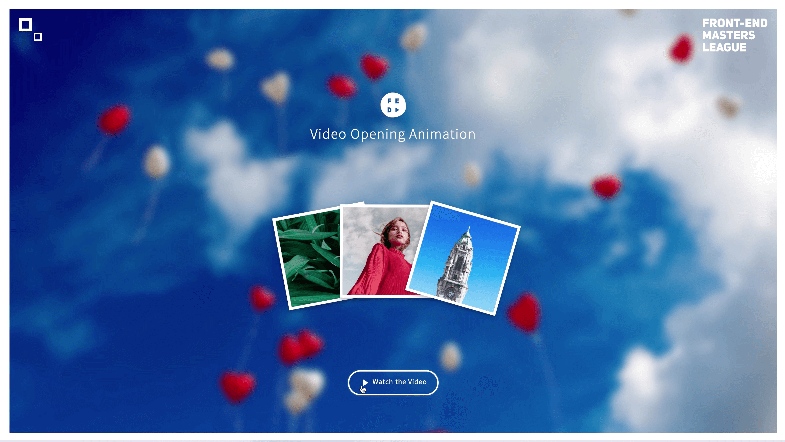
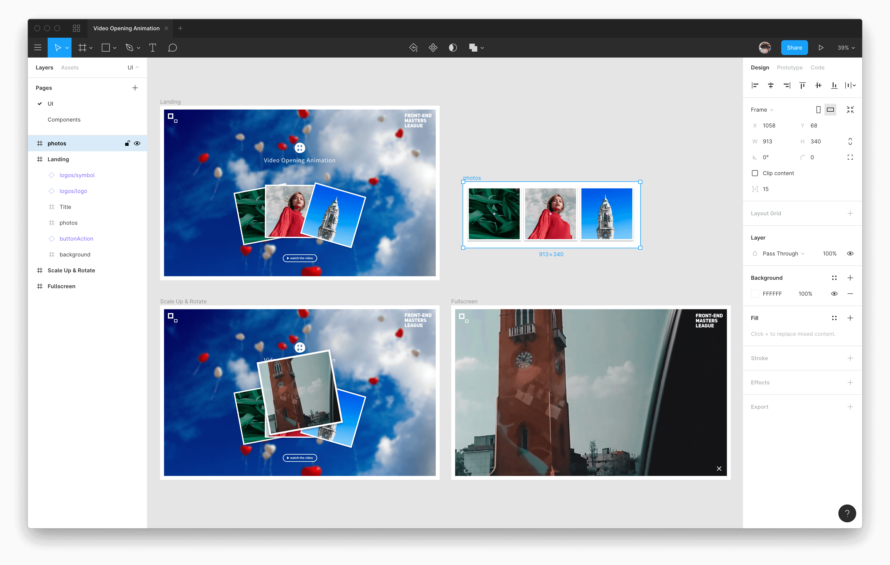
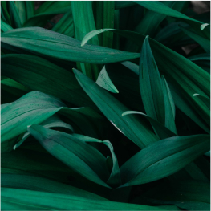
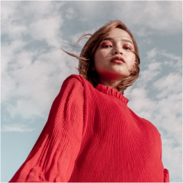
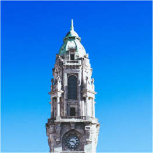

# 풀스크린 비디오 오프닝 애니메이션

'비디오 보기(Watch the Video)' 버튼을 클릭하면 비디오를 포함하는 프레임이 애니메이션 됩니다.
적용된 애니메이션은 프레임이 회전하며 전체 화면 크기로 확대됩니다. 비디오는 프레임이 등장과 동시에 재생되며,
'닫기(close, ×) 버튼'을 클릭 또는 비디오 재생이 종료되면 자동으로 비디오가 사라집니다.

[](https://www.youtube.com/watch?v=FOsh3ZZU0Lo)

## 디자인 리소스 (Design Resources)

예제에 사용한 리소스는 Pexels Video의 콘텐츠입니다. 
Pexels Video는 다양한 이미지와 비디오를 무료로 제공합니다.

- [Pexels](https://www.pexels.com, 'Photo')
- [Pexels Video](https://www.pexels.com/videos, 'Video')

## 비주얼 디자인 (Visual Design)

[<abbr title="Fullscreen Video Opening Animation">FVOA</abbr>](https://www.figma.com/file/qFisa7X0NevFLZ3RHi42yz/Video-Opening-Animation?node-id=0%3A1) 디자인은 [Figma](https://figma.com)로 제작되었습니다. 링크를 클릭하면 디자인 시안을 브라우저에서 살펴볼 수 있습니다.

[](https://www.figma.com/file/qFisa7X0NevFLZ3RHi42yz/Video-Opening-Animation?node-id=0%3A1)

## 구조 디자인 (Semantic Markup)

비주얼 디자인 시안을 참고하여 구조를 분석한 후, 의미적이고 올바른 구조를 작성합니다.

### 헤더 (Header)

헤더 영역의 기본 골격을 작성한 후, 적절한 이름의 클래스 또는 언어 속성 등을 추가합니다.

```html
<header>
  <h1>
    Fullscreen Video Opening Animation
  </h1>
  <figure>
    
    
  </figure>
</header>
```

<!-- ```html
<header>
  <h1 lang="en" class="a11y-hidden a11y-hidden--focusedVisible" tabindex="0">
    Fullscreen Video Opening Animation
  </h1>
  <figure role="group" lang="en">
    
    
  </figure>
</header>
``` -->

### 메인 (Main)

메인 영역의 기본 골격을 작성한 후, 적절한 이름의 클래스 또는 언어 속성을 추가합니다.

```html
<main>
  <h2>
    
    Video Opening Animation
  </h2>
  <figure>
    
    
    
  </figure>
  <div>
    
    <button type="button">
      
      Watch the Video
    </button>
    <div>
      <div>
        <video
          preload="auto"
          poster="./assets/media/poster__city-rehan-verma.png"
          src="./assets/media/city-rehan-verma.mp4">
        </video>
        <button type="button">
          
        </button>
      </div>
    </div>
  </div>
</main>
```

<!-- ```html
<main class="container--demo">
  <h2 class="main__title" lang="en">
    
    Video Opening Animation
  </h2>
  <figure role="group" class="photos">
    
    
    
  </figure>
  <div class="action__wrapper">
    
    <button type="button" class="action--play" lang="en">
      
      Watch the Video
    </button>
    <div class="video__outer">
      <div class="video__inner">
        <video
          class="video"
          preload="auto"
          poster="./assets/media/poster__city-rehan-verma.png"
          src="./assets/media/city-rehan-verma.mp4">
        </video>
        <button type="button" class="action--close">
          
        </button>
      </div>
    </div>
  </div>
</main>
``` -->

## 표현 디자인 (Styling & Animation)

탄탄한 구조 작성이 마무리 되면, 비주얼 디자인을 참고하여 스타일링 합니다.

### 모듈 스타일링 (Modular Styling)

분리, 관리되는 각 스타일 모듈은 수업 시간에 살펴봅니다.

```css
@import url("https://spoqa.github.io/spoqa-han-sans/css/SpoqaHanSans-kr.css");
@import url("./modules/normalize.css");
@import url("./config.css");
@import url("./parts/base.css");
@import url("./parts/a11y.css");
@import url("./parts/typography.css");
@import url("./parts/layout.css");
@import url("./demo/index.css");
@import url("./demo/intro-animation.css");
```

## 인터래션 디자인 (Interaction)

구조, 스타일링, 애니메이팅이 완료되면 스크립트를 사용하여 인터랙션을 구현합니다.

- DOM API + ECMAScript(JavaScript) 
- HTML5 Video 이벤트 핸들링
  - [canplaythrough](https://developer.mozilla.org/ko/docs/Web/API/HTMLMediaElement/canplaythrough_event)
  - [ended](https://developer.mozilla.org/en-US/docs/Web/API/HTMLMediaElement/ended_event)

```js
/**
 * main.js
 *  
 * Copyright 2019, Front-End Masters League
 * http://yamoo9.github.io
 */

;(function(){
	'use strict'

  // 문서 객체를 각 변수에 참조합니다.
  var actionWrapper, 
      actionPlayButton, 
      actionCloseButton, 
      videoOuter, 
      videoPlayer;

	function bootstrap(){
		// 코드를 작성합니다.
	}

	function bindEvents(){
		// 코드를 작성합니다.
	}

	function canPlaying(){
		// 코드를 작성합니다.
	}

	function showVideo(){
		// 코드를 작성합니다.
	}

	function hideVideo(){
		// 코드를 작성합니다.
	}

	bootstrap()
})()
```

<!-- ```js
/**
 * main.js
 *
 * Licensed under the MIT license.
 * http://www.opensource.org/licenses/mit-license.php
 * 
 * Copyright 2019, Front-End Masters League
 * http://yamoo9.github.io
 */

;(function(){
	'use strict'

	var actionWrapper = document.querySelector('.action__wrapper')
	var actionPlayButton = document.querySelector('.action--play')
	var actionCloseButton = document.querySelector('.action--close')
	var videoOuter = document.querySelector('.video__outer')
	var videoPlayer = videoOuter.querySelector('.video')

	function bootstrap(){
		bindEvents()
	}

	function bindEvents(){
		actionPlayButton.addEventListener('click', showVideo)
		actionCloseButton.addEventListener('click', hideVideo)
		videoPlayer.addEventListener('canplaythrough', canPlaying)
		videoPlayer.addEventListener('ended', hideVideo)
	}

	function canPlaying(){
		actionWrapper.classList.add('video--loaded')
	}

	function showVideo(){
		videoOuter.classList.remove('video--hide')
		videoOuter.classList.add('video--show')
		actionPlayButton.style.zIndex = 10
		videoPlayer.currentTime = 0
		window.setTimeout(function(){
			videoPlayer.play()
		}, 400)
	}

	function hideVideo(){
		videoOuter.classList.remove('video--show')
		videoOuter.classList.add('video--hide')
		actionPlayButton.removeAttribute('style')
		videoPlayer.pause()
	}

	bootstrap()
})()
``` -->