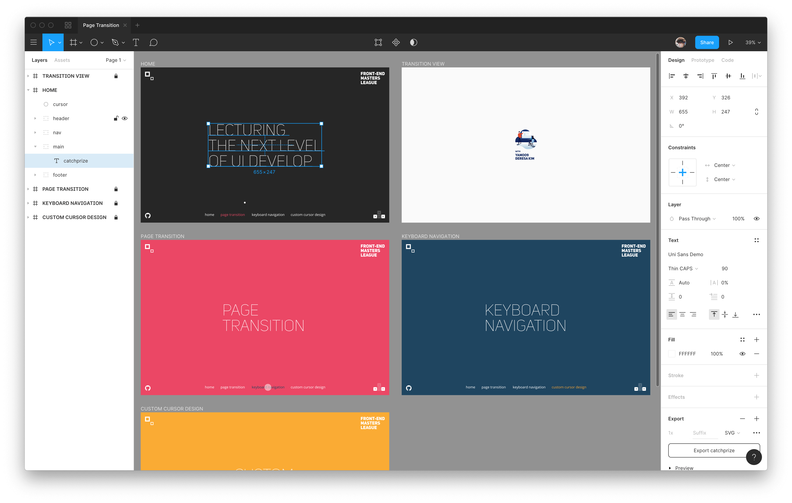
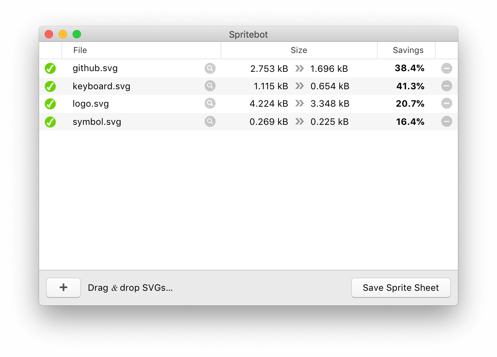
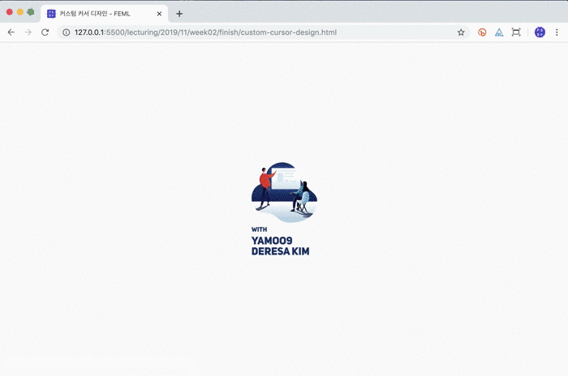
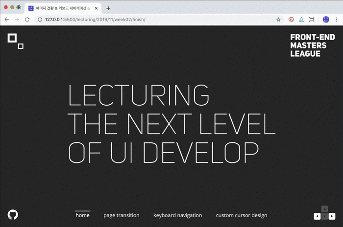
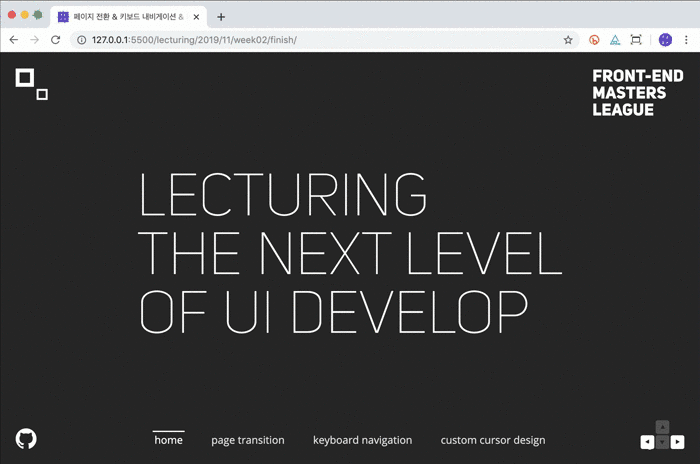

# 페이지 내비게이션 & 커서 디자인

HTML 페이지 전환, 키보드 내비게이션, 커스텀 커서 디자인을 JavaScript 프로그래밍을 사용해 구현해봅니다.

1. [Page Transition](#html-페이지-전환-page-transition)
1. [Keyboard Navigation](#키보드-내비게이션-keyboard-navigation)
1. [Custom Cursor Design](#커스텀-커서-디자인-custom-cursor-design)

 

## 디자인 리소스

[Figma](https://figma.com/downloads) 디자인 도구로 제작된 페이지 트랜지션 & 내비게이션 실습 디자인 시안 파일입니다. 다운로드 링크를 눌러 디자인 파일을 다운로드 한 후, Figma를 사용해 디자인을 분석합니다.

[→ 다운로드](https://github.com/yamoo9/front-end-master/raw/master/assets/Page%20Transition.fig)

<!-- Figma .fig 파일 공유 -->

### SpriteBot

SVG 이미지 파일 최적화 및 스프라이트 이미지 제작에 활용할 수 있는 오픈 소스 GUI 도구 입니다. 사용법은 SVG 파일을 도구에 Drag & Drop 한 후, `Save Sprite Sheet` 버튼을 클릭하고 저장할 위치를 설정합니다. SVG 스프라이트 이미지를 활용하는 방법은 수업 시간에 다룹니다.

[→ 다운로드](https://github.com/thomasjbradley/spritebot/releases)

 
 

## HTML 페이지 전환 (Page Transition)

일반적으로 HTML 페이지가 전환되면 깜빡임 현상이 발생하며 연결된 페이지가 해석되어 화면에 렌더링 됩니다. 이러한 웹의 사용자 경험(UX)을 향상시킬 목적으로 JavaScript 프로그래밍으로 로딩 중간 단계에 특정 화면을 표시하고 부드럽게 전환되도록 만들어 봅니다.

 
 
 
 
 
 
 
 
 
 
 
 
 
 

## 키보드 내비게이션 (Keyboard Navigation)

페이지 간 이동 기능을 키보드로 제어할 수 있도록 JavaScript로 프로그래밍 합니다. 왼쪽 화살표(`←`) 또는 오른쪽 화살표(`→`) 키를 눌러 각 페이지를 탐색합니다.

 
 
 
 
 
 
 
 
 
 
 
 
 
 

## 커스텀 커서 디자인 (Custom Cursor Design)

마우스 커서의 모양, 움직임 등을 JavaScript 프로그래밍을 사용하여 커스텀 디자인 합니다.

