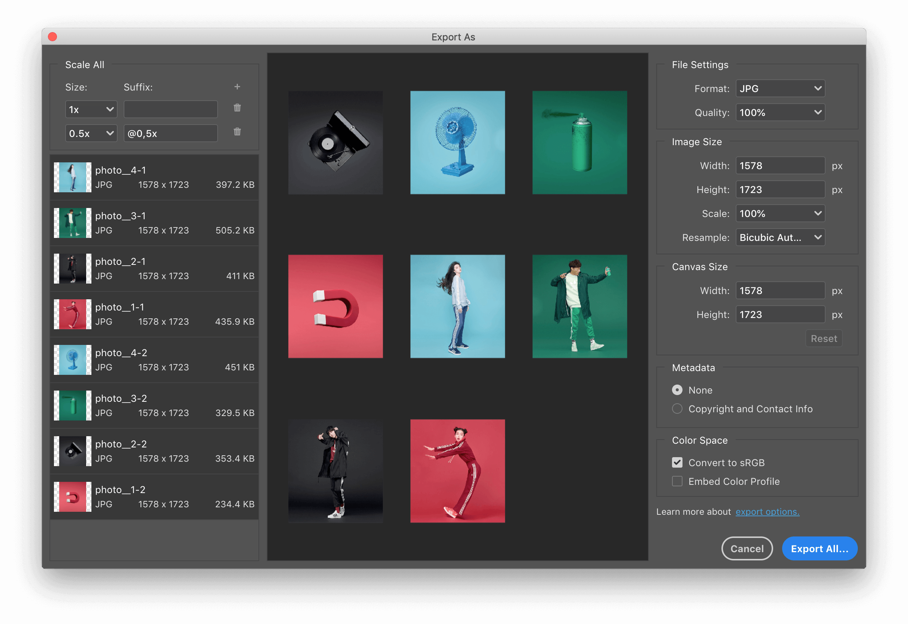
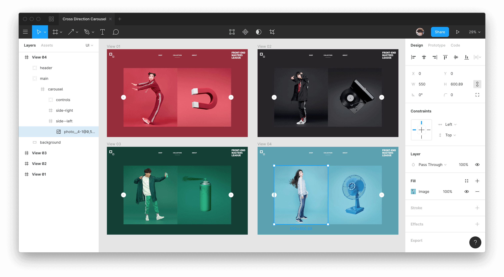

# 캐러셀 컴포넌트 디자인

캐러셀(Carousel) 컴포넌트를 라이브러리 도움 없이, 순수한 JavaScript 프로그래밍으로 구현해봅니다.

1. [캐러셀 (General Carousel)](step-01-캐러셀)
1. [인피니티 캐러셀 (Infinity Carousel)](#step-02-인피니티-캐러셀)
1. [크로스 디렉션 캐러셀 (Cross Direction Carousel)](#step-03-크로스-디렉션-캐러셀)

 

## 완성 결과

이미지를 클릭하면 크로스 디렉션 캐러셀 컴포넌트가 작동하는 고화질 영상을 볼 수 있습니다.

## 디자인 리소스

영국 브리스톨(Bristol, UK)의 크리에이티브 스튜디오 [Green Chameleon](https://www.craftedbygc.com/)의 공동 창립자이자, 디자인 디렉터인 Nathan Riley의 작품 [Adicolor SS2018 Lookbook Carousel](https://dribbble.com/shots/4062487-Adicolor-SS2018-Lookbook-Carousel)을 모티브(motive) 삼아 데모를 진행해봅니다.

### 포토 에디팅

'사진 합성 및 보정, 편집'은 Adobe Photoshop으로 만드는 것이 가장 유용합니다.

### 레이아웃 디자인

'웹/앱 레이아웃 디자인'은 Figma와 같은 UI 디자인에 최적화 된 도구를 사용하는 것이 효율적입니다.

[→ 다운로드](https://github.com/yamoo9/front-end-master/raw/master/assets/Cross%20Direction%20Carousel.fig)

<!-- Figma .fig 파일 공유 -->
<!-- https://dribbble.com/search/carousel -->

 

## STEP 01. 캐러셀

라이브 코딩을 진행하며 구조, 표현, 동작을 구현합니다. 캐러셀 컴포넌트의 작동 원리 및 각 컨트롤 구조 및 용어를 정리하며 실습합니다.

 

## STEP 02. 인피니티 캐러셀

라이브 코딩을 진행하며 구조, 표현, 동작을 구현합니다. 인피니티 컴포넌트의 작동 원리에 대해 설명하며 실습합니다.

 

## STEP 03. 크로스 디렉션 캐러셀

begin 압축 파일을 제공하고 JavaScript 프로그래밍 부분만 작성해 실습합니다. 앞서 STEP 01, 02 에서 다룬 내용을 포함하므로 반복 학습 뿐만 아니라, 실무에 적용 가능한 응용 능력을 키웁니다.